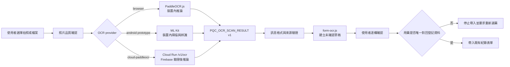

# 噴前查 OCR 系統規格與架構書

> 文件目的：讓第一次接觸專案的工程師，在不依賴過往對話的情況下，能審查 OCR 的技術選擇、程式邊界、安全性與是否具備正式啟用條件。
>
> 文件基準：2026-08-04，分支 `agent/cloud-paddleocr-backend`。本文件是由現有程式反推的 As-Is 規格，不代表所有項目都已正式上線。

## 1. 一頁摘要

噴前查的 OCR 不是「拍完直接登打」，而是「圖片辨識 → 產生欄位候選 → 人工確認 → 再帶入既有紀錄表單」。產品刻意把辨識與正式紀錄分開，避免中文表格誤讀直接變成錯誤的農務或用藥紀錄。

目前三種執行方式共用同一份結果協定：

| 路徑 | 技術 | 現況 | 圖片位置 | 主要限制 |
|---|---|---|---|---|
| 瀏覽器 OCR | PaddleOCR.js、ONNX Runtime Web、PP-OCRv6 tiny | 前端測試中 | 使用者裝置 | iPhone 分頁 RAM 可能不足 |
| Android 原型 | ML Kit Document Scanner、中文 Text Recognition | 獨立 APK 原型，未接正式 TWA | 使用者裝置 | 缺正式 Android/TWA 原始碼整合 |
| 雲端 OCR | FastAPI、PaddleOCR 3.7、PP-OCRv6 small、Cloud Run | 程式骨架完成，預設關閉且未部署 | 噴前查控制的後端記憶體 | 需完成部署、成本、隱私、負載與真實表單驗收 |

公開設定目前仍是：

```js
ocr: {
  provider: "browser",
  cloud: { endpoint: "", requireGoogleLogin: true }
}
```

因此合併本分支不會讓正式網站上傳照片。

## 2. 系統目標與非目標

### 2.1 目標

- 降低紙本紀錄重新鍵入的負擔。
- 從常見產銷履歷／TGAP 表單提出日期、田區、作物、資材等候選值。
- 保留每個候選值的信心或來源，讓使用者逐欄確認。
- 用藥名稱只能在唯一對回站內登記資料後帶入。
- 讓辨識引擎可替換，但不改變後續人工確認與紀錄邏輯。

### 2.2 明確非目標

- 不宣稱能辨識所有任意表格。
- 不把 OCR 結果自動保存成正式紀錄。
- 不由 OCR 推測法規合法性、稀釋倍數或安全採收期。
- 不把照片或文字交給未揭露的第三方服務。
- 不在尚未實測前宣稱「一定省工」或「可直接上傳 L3」。

## 3. 架構與資料流



### 3.1 前端責任

| 檔案 | 責任 |
|---|---|
| `form-ocr-ui.js` | 功能旗標、provider 選擇、拍照／檔案入口、Google token、雲端請求、結果訊息驗證、草稿畫面與帶入前檢查 |
| `form-ocr.js` | 純資料邏輯：品質判定、文字正規化、日期／田區／作物／資材／稀釋倍數等候選解析、未確認草稿建立 |
| `paddle-ocr-browser.js` | 按需載入 PaddleOCR.js 與模型，在瀏覽器內輸出文字區塊 |
| `service-config.js` | 公開的 provider、endpoint 與功能發布狀態；不得放私鑰 |

`form-ocr.js` 應保持與 DOM、網路及特定 OCR 引擎解耦，以便用 Node 測試候選解析規則。

### 3.2 雲端責任

| 檔案 | 責任 |
|---|---|
| `cloud-ocr-service/app/main.py` | FastAPI 路由、大小限制、逾時控制與回應協定 |
| `cloud-ocr-service/app/security.py` | Origin 白名單、Firebase ID token 驗證、每使用者速率限制 |
| `cloud-ocr-service/app/ocr.py` | 圖片格式／像素檢查、EXIF 方向修正、Paddle 模型載入與結果標準化 |
| `cloud-ocr-service/Dockerfile` | 非 root 執行、建置期快取模型、單 worker 啟動 |

## 4. 共用結果協定

三種引擎都應回傳下列 JSON 形狀；不得包含 Base64 圖片、原圖網址或未受限的任意物件。

```json
{
  "type": "PQC_OCR_SCAN_RESULT",
  "protocolVersion": 1,
  "requestId": "cloud-或裝置端產生的識別碼",
  "createdAt": "2026-08-04T00:00:00Z",
  "engine": "辨識引擎名稱與版本",
  "source": "browser-paddleocr | android-mlkit | cloud-paddleocr",
  "quality": {
    "width": 1600,
    "height": 2200,
    "cornersDetected": true,
    "cornersConfirmedByUser": false,
    "assessment": "user-confirmed-before-upload"
  },
  "blocks": [
    {
      "id": "cloud-1",
      "text": "民國115年7月30日",
      "confidence": 0.91,
      "box": { "left": 0.1, "top": 0.2, "right": 0.5, "bottom": 0.25 }
    }
  ]
}
```

協定要求：

- `protocolVersion` 不相符時拒絕。
- `blocks[].text` 要限制長度，區塊總數要限制。
- 座標統一為 0～1 的相對值。
- `confidence` 限制在 0～1。
- 前端接收後仍只建立 `confirmed: false` 的草稿。
- Android 訊息必須驗證來源與 `requestId`；網頁不得接收圖片內容。
- 雲端模式由前端產生 `requestId`，後端驗證格式後原樣回傳，前端只接受本次請求的結果。
- `cornersDetected` 只代表程式偵測；使用者勾選照片完整時使用 `cornersConfirmedByUser`，兩者不得混用。

## 5. 雲端 API 契約

### 5.1 `GET /healthz`

- 用途：容器健康檢查。
- 成功：`200 {"status":"ok"}`。
- 不代表 Paddle 模型已完成真實推論驗收。

### 5.2 `POST /v1/ocr`

- `Content-Type`: `multipart/form-data`
- 欄位：`image`
- 欄位：`request_id`，1～128 字元，只允許英數、`.`、`_`、`:`、`-`，後端須原樣回傳。
- 驗證：`Authorization: Bearer <Firebase ID token>`
- 瀏覽器來源：必須精確符合設定的 HTTPS Origin。
- 格式：JPG、PNG、WebP。
- 檔案上限：預設 12 MiB。
- 像素上限：2,400 萬像素。
- 最小尺寸：寬、高皆至少 480 px。
- 處理逾時：預設 45 秒。
- 成功：`200`，回傳共用結果協定。
- 常見錯誤：`401` 未登入或 token 無效、`403` Origin 不允許、`413` 檔案過大、`422` 圖片／辨識內容不合格、`429` 頻率過高、`504` 推論逾時。

目前程式的速率限制是單一容器記憶體內、每位使用者每分鐘 10 次。它不是跨執行個體的全域配額，正式商用前應改用 Cloud Armor、API Gateway、Redis／資料庫計數器或其他集中式方案。

## 6. 安全與隱私模型

### 6.1 已實作控制

- endpoint 只接受 HTTPS，前端不附 Cookie，並使用 `no-referrer`。
- 雲端模式要求 Google 登入並傳送短期 Firebase ID token。
- 後端精確比對 Origin，且 Firebase Admin 驗證 token 與撤銷狀態。
- 限制 MIME、上傳 bytes、解碼後像素、最小尺寸、推論時間與回傳區塊。
- 後端用記憶體處理圖片，不主動寫檔。
- 容器以非 root 使用者執行；單 worker／單並行降低模型執行緒風險。
- 每次上傳前要求單次同意；回傳只進入未確認草稿。

### 6.2 仍須評審與驗證

- Cloud Run、負載平衡器與 Cloud Logging 是否真的沒有記錄 body、token 或 OCR 文字。
- 暫存、錯誤追蹤、記憶體傾印與供應商診斷資料的保存政策。
- CORS／Origin 不是 API 的唯一授權機制；需評估 App Check、WAF 與濫用防護。
- Firebase token 驗證成功後，目前只做 UID 配額，尚未做付費方案或角色授權。
- 圖片解壓縮炸彈、畸形檔案及 Paddle／Pillow 依賴漏洞的持續掃描。
- 多執行個體時的全域限流與預算上限。
- 使用者刪除請求、事件稽核與隱私政策文字是否符合實際雲端設定。

## 7. 部署模型

建議先部署獨立測試服務，不直接切換正式 provider：

1. Cloud Build 建置容器，建置期下載並固定模型。
2. Artifact Registry 保存帶版本標籤與 digest 的映像檔。
3. Cloud Run 設 2 CPU、至少 4 GiB、concurrency 1、timeout 60 秒、min 0、max 3。
4. 設定專用服務帳戶、預算警報、最大執行個體數與允許來源。
5. 用測試帳號與去識別化表單完成資安、成本及辨識驗收。
6. 最後才在另一個 PR 把 `provider` 改為 `cloud-paddleocr` 並填入 `/v1/ocr`。

## 8. 測試與可重現性

### 8.1 目前自動測試

```powershell
npm run release:check
```

包含前端協定、草稿解析、安全檢查、功能發布閘門與發布檔案白名單。

後端純邏輯測試：

```powershell
cd cloud-ocr-service
python -m pip install -r requirements-dev.txt
python -m pytest tests -q
```

目前已做 Python AST 語法檢查，但此分支尚未在本機實際下載 Paddle 模型、執行推論或建置 Docker 映像；評審者不應把「語法與單元測試通過」解讀成「雲端 OCR 已驗收」。

### 8.2 正式啟用前最低驗收資料

- 至少 30～50 張取得同意、去識別化且保留原始品質的真實表單。
- 覆蓋手寫／印刷、直拍／斜拍、不同光線、折痕、污漬與不同手機。
- 欄位級 precision、recall、無候選率、誤帶入率。
- 冷啟動／暖啟動延遲、記憶體峰值、單張成本與逾時率。
- 與人工逐筆登打相比的完成時間及修正次數，而不只量 OCR 字元正確率。
- 用藥名稱唯一對回與不確定時阻擋流程必須 100% 通過。

## 9. 已知技術債與建議評審問題

優先請資工評審者回答：

1. PaddleOCR 3.7 的輸出物件在目前固定版本中，`rec_texts`、`rec_scores`、`rec_polys` 正規化是否涵蓋所有回傳型態？
2. 建置期模型快取在 Cloud Run 的非 root HOME 下是否可重現，是否需要明確固定模型檔 checksum？
3. 單 worker、concurrency 1 與 4 GiB 是否足夠；冷啟動、CPU threads 與成本如何平衡？
4. `asyncio.to_thread` 逾時後，底層 Paddle 推論執行緒是否仍持續占用資源？要不要改成工作程序隔離或佇列？
5. 記憶體限流是否需改為跨執行個體方案？
6. 圖片沒有落盤的前提，是否仍會被平台日誌、APM 或錯誤追蹤擷取？
7. 如何建立不含個資但能代表實際表單的版本化基準資料集？
8. 前端候選解析是否應改成欄位位置／模板輔助，而非只依全文規則？

## 10. 修改規則

- 先更新 `specs/001-ocr-assist/spec.md` 的需求或驗收條件，再改程式。
- 改共用 JSON 形狀時同步更新 `protocolVersion`、三種 provider、前端驗證與測試。
- 未完成的功能不得以正式功能出現在前端；測試入口必須顯示「測試中・開發中」。
- 任何能繞過人工確認、直接寫入正式紀錄的變更都視為高風險，需另行設計審查。
- 不把照片、OCR 文字、Firebase token、服務帳戶或私鑰提交到 Git。

## 11. 相關文件

- [`../cloud-ocr-service/README.md`](../cloud-ocr-service/README.md)
- [`../android-ocr-prototype/README.md`](../android-ocr-prototype/README.md)
- [`Android OCR正式整合.md`](Android%20OCR正式整合.md)
- [`雲端PaddleOCR設計與啟用檢查表.md`](雲端PaddleOCR設計與啟用檢查表.md)
- [`前端功能發布規則.md`](前端功能發布規則.md)
- [`農友訪談回饋-特殊作業對照.md`](農友訪談回饋-特殊作業對照.md)
