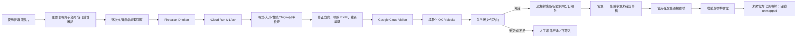

# 噴前查 OCR 系統規格與架構書

> 文件基準：2026-08-09。OCR 已由裝置內／自架模型改為雲端文件辨識服務；staging Cloud Run 後端已部署，前端入口仍為 `development`，並受測試驗證碼鎖定。產銷履歷實際操作依據見 [`產銷履歷系統錄影-操作流程與欄位地圖.md`](./產銷履歷系統錄影-操作流程與欄位地圖.md)。

## 1. 目標與非目標

目標是把產銷履歷紙本照片轉成「待人工確認的欄位候選」，減少重複抄寫。系統不承諾完全自動化，不直接替使用者判斷缺漏內容，也不把 OCR 結果直接寫入正式紀錄或產銷履歷系統。

成功必須同時滿足：辨識正確、使用者知道哪些欄位不確定、總作業時間比原流程短、照片與帳號資料受到合理保護。

## 2. 目前元件

| 元件 | 技術 | 狀態 | 責任 |
|---|---|---|---|
| PWA | 原生 JavaScript | OCR 測試入口 | 驗證碼、拍照／選檔、可讀性確認、逐次同意、單筆與多筆草稿覆核 |
| OCR API | FastAPI／Cloud Run | staging 已部署 | 驗證登入、限制請求、圖片清理、呼叫 Vision |
| OCR 引擎 | Google Cloud Vision `DOCUMENT_TEXT_DETECTION` | 尚未實機驗收 | 回傳文字階層、信心值與座標 |
| 欄位解析 | `form-ocr.js` | 已有測試 | 日期、作物、資材、數量、稀釋倍數等候選 |
| Android 原型 | ML Kit | 獨立原型 | 原生掃描研究，不在本次 PWA 啟用範圍 |

## 3. 資料流程



瀏覽器不得直接呼叫 Vision API。Google Cloud 憑證只能透過 Cloud Run 附加的專用服務帳戶與 Application Default Credentials 取得。

### 3.1 文件路由

| 路由 | 例子 | 目前結果 | 正式 L3 狀態 |
|---|---|---|---|
| `production-record` | 用藥、施肥、栽培、採收、採後處理 | 經人工確認後帶入既有表單 | 等官方代碼映射 |
| `supporting-record` | 設備保養、維修、校正、清潔 | 本機多筆輔助紀錄 | 上傳範圍待確認 |
| `material-ledger` | 肥料／資材入出庫 | 庫存草稿或匯出 | 不視為單筆作業，範圍待確認 |
| `reference-only` | 生產及出貨自我查核表 | 原文與候選供備查，可略過 | 不建立日常生產紀錄 |
| `master-data` | 農戶、地籍、田區基本資料 | 只供逐欄人工整理 | 等主檔 API 與權限規格 |
| `admin-output` | 驗證、商品審核、標籤列印 | 不建立紀錄 | 不複製官方高權限後台 |
| `unknown` | 混合頁、背景干擾或證據不足 | 人工選用途或略過 | 不做上傳推定 |

分類只在第一名至少命中兩個同類標記且未與第二名同分時標為 `exact`；其餘為 `ambiguous` 或 `unknown`，禁止自動採用第一候選。

## 4. API 協定

### 請求

- `POST /v1/ocr`
- `Authorization: Bearer <Firebase ID token>`
- `multipart/form-data`
- `image`: JPG、PNG 或 WebP，12 MB 以下、2,400 萬像素以下
- `request_id`: 1–128 字元，僅英數、`.`、`_`、`:`、`-`

### 回應

```json
{
  "type": "PQC_OCR_SCAN_RESULT",
  "protocolVersion": 1,
  "requestId": "cloud-...",
  "engine": "Google Cloud Vision DOCUMENT_TEXT_DETECTION",
  "source": "google-cloud-vision",
  "quality": {
    "width": 1600,
    "height": 2200,
    "cornersDetected": false,
    "cornersConfirmedByUser": true,
    "assessment": "user-confirmed-before-upload"
  },
  "layout": {
    "version": 1,
    "coordinateSpace": "normalized",
    "indexBase": 0,
    "wordGeometry": true
  },
  "blocks": [
    {
      "id": "cloud-1",
      "text": "...",
      "confidence": 0.91,
      "box": {"left": 0.1, "top": 0.1, "right": 0.9, "bottom": 0.2},
      "source": {"pageIndex": 0, "blockIndex": 1, "paragraphIndex": 2},
      "blockBox": {"left": 0.08, "top": 0.08, "right": 0.92, "bottom": 0.24},
      "words": [
        {
          "id": "cloud-1-w1",
          "text": "...",
          "confidence": 0.94,
          "box": {"left": 0.1, "top": 0.1, "right": 0.2, "bottom": 0.14},
          "detectedBreak": {"type": "SPACE", "isPrefix": false}
        }
      ],
      "wordsTruncated": false
    }
  ],
  "retention": "not-stored"
}
```

前端必須核對 `type`、`protocolVersion`、`requestId`、大小與 blocks 格式；不得接受影像 base64 或任意外部 URL 混入結果。

## 5. 結果驗證

- `protocolVersion` 不相符時拒絕。
- `blocks[].text` 要限制長度，區塊總數要限制。
- 座標統一為 0～1 的相對值。
- `confidence` 限制在 0～1。
- 每段保留頁次、區塊與段落索引；單字層級保留位置與換行提示，供後續同列配對與人工回看。
- 後端最多回傳 500 段、每段 200 個單字位置、整份 5,000 個單字位置；超出時以 `wordsTruncated` 明示，不讓大型文件無限制占用記憶體。
- 多圖批次中的每張照片有本機 `sourceImageId`、固定來源順序及處理狀態；草稿不保存 `File`、Object URL、Base64 或原始照片內容。
- 前端接收後仍只建立 `confirmed: false` 的草稿。
- Android 訊息必須驗證來源與 `requestId`；網頁不得接收圖片內容。

### 5.1 實際照片容錯原則

- 不要求使用者只拍單張平整空白表格；可接受整本紀錄、跨頁、書本邊緣與周遭背景。
- 上傳前只要求「主要表格與手寫內容可閱讀」，不再以四角完整作為硬性門檻。
- 背景新聞文字或另一頁內容可能被 OCR 一併讀入，因此欄位整理必須先辨識表名、日期列與印刷選項，再交由人工覆核。
- 同一張設備管理表可依日期拆成多筆草稿；後續列省略年份時，可沿用同頁最近辨識到的年份，但必須降低信心並保留人工確認。
- 無法可靠拆列或看不清楚的欄位保留空白，不猜測、不自動儲存；使用者可在批次編輯器新增、刪除或修正列。

### 5.2 已支援的設備管理紀錄

`表 18 器具／機械／設備之保養、維修、校正及清潔管理紀錄` 已納入本機輔助紀錄類型。每筆可包含多項設備與多項作業，同一張照片可建立多筆待確認草稿。共用設備不強制綁定田區；需要時仍可由使用者選擇田區。是否屬於 L3 可上傳範圍尚未經官方規格確認，介面不得宣稱可直傳。

## 6. 安全與隱私

- 未登入、未勾選單次同意或端點未設定時，不得上傳照片。
- Cloud Run 對外可連線，但應用層必須驗證 Firebase ID token。
- 只允許 `https://searchbefore.tw` 等明列 Origin，不使用寬鬆萬用字元。
- 後端重新編碼圖片，避免原始 EXIF、附加資料與不可信檔案內容直接送至 Vision。
- 程式不寫入圖片、OCR 文字或 token；正式環境要再次檢查 Cloud Logging。
- 以每 UID 限流、Google Cloud 配額、預算通知與最大執行個體數共同控制濫用及費用。
- OCR 結果一律是未確認草稿；用藥資料無法唯一對回正式登記時，阻擋帶入。

### 6.1 兩道驗證門檻

- `validateDraftForReview()`：只判斷能否把可辨識欄位帶進既有表單繼續人工整理；不會儲存紀錄。
- `validateDraft()`／`validateConfirmedFields()`：依紀錄類型檢查正式儲存必填欄位，回傳 `ok`、`missing`、`warnings`、`mappingPending`。
- 施肥、採收、採後處理、栽培與資材購入不共用同一套必填條件；資材購入不要求作物，但依目前本機資料模型仍需田區／種植批次。
- `mappingPending` 只表示 L3 尚待正式代碼映射，絕不能被解讀為已可上傳。

## 7. 發布閘門

1. `hidden`：不建立入口。
2. `development`：目前狀態；需驗證碼、指定測試、Google 登入及單次同意，且入口、標題與按鈕都標示測試中／開發中。
3. `public`：完成跨裝置、失敗情境、欄位正確率、人工覆核、費用與省工比較後才可評估。

## 8. 尚待完成

- staging 已部署；仍須在後台驗證專用服務帳戶最小權限、Vision 配額、預算通知、Cloud Run 最大執行個體與日誌遮罩。
- 使用真實樣本驗證繁體中文、手寫、多列、跨頁、背景干擾、歪斜、反光與模糊情境。
- 確認 Cloud Logging、錯誤追蹤與分析資料不含敏感內容。
- 以具名測試者完成 `/v1/ocr` 的驗證碼、登入、逐次同意、CORS、413、422、429、逾時與錯誤情境驗收。
- 建立「作業主表＋多筆明細」標準草稿，並為每個候選保存來源圖片、頁次、文字區塊與座標。
- 擴充表格結構資料；目前段落層文字不足以可靠配對購入量、使用量、剩餘量與勾選欄位。
- 比較人工原流程與 OCR 輔助流程的單筆總時間；若沒有省工，不進入公開階段。

## 9. 主要檔案

- `form-ocr.js`：候選解析與人工確認規則。
- `form-ocr-ui.js`：照片選擇、同意、網路呼叫與草稿介面。
- `service-config.js`：公開 provider、endpoint 與發布狀態。
- `cloud-ocr-service/app/main.py`：API 與逾時控制。
- `cloud-ocr-service/app/security.py`：Firebase token、Origin 與限流。
- `cloud-ocr-service/app/ocr.py`：圖片清理、Vision 呼叫與結果標準化。
- `docs/Google Cloud Vision設計與啟用檢查表.md`：部署及驗收清單。
