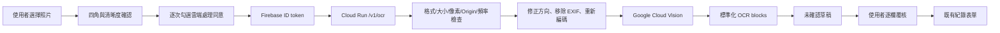

# 噴前查 OCR 系統規格與架構書

> 文件基準：2026-08-04。OCR 已由裝置內／自架模型改為 Google Cloud Vision；目前後端程式完成、尚未部署，前端入口為 `hidden`。

## 1. 目標與非目標

目標是把產銷履歷紙本照片轉成「待人工確認的欄位候選」，減少重複抄寫。系統不承諾完全自動化，不直接替使用者判斷缺漏內容，也不把 OCR 結果直接寫入正式紀錄或產銷履歷系統。

成功必須同時滿足：辨識正確、使用者知道哪些欄位不確定、總作業時間比原流程短、照片與帳號資料受到合理保護。

## 2. 目前元件

| 元件 | 技術 | 狀態 | 責任 |
|---|---|---|---|
| PWA | 原生 JavaScript | 正式 OCR 入口隱藏 | 拍照／選檔、品質確認、逐次同意、草稿覆核 |
| OCR API | FastAPI／Cloud Run | 程式完成、未部署 | 驗證登入、限制請求、圖片清理、呼叫 Vision |
| OCR 引擎 | Google Cloud Vision `DOCUMENT_TEXT_DETECTION` | 尚未實機驗收 | 回傳文字階層、信心值與座標 |
| 欄位解析 | `form-ocr.js` | 已有測試 | 日期、作物、資材、數量、稀釋倍數等候選 |
| Android 原型 | ML Kit | 獨立原型 | 原生掃描研究，不在本次 PWA 啟用範圍 |

## 3. 資料流程



瀏覽器不得直接呼叫 Vision API。Google Cloud 憑證只能透過 Cloud Run 附加的專用服務帳戶與 Application Default Credentials 取得。

## 4. API 協定

### 請求

- `POST /v1/ocr`
- `Authorization: Bearer <Firebase ID token>`
- `multipart/form-data`
- `image`: JPG、PNG 或 WebP，12 MB 以下、2,400 萬像素以下
- `request_id`: 1–128 字元，僅英數、`.`、`_`、`:`、`-`

### 回應

```json
{
  "type": "PQC_OCR_SCAN_RESULT",
  "protocolVersion": 1,
  "requestId": "cloud-...",
  "engine": "Google Cloud Vision DOCUMENT_TEXT_DETECTION",
  "source": "google-cloud-vision",
  "quality": {
    "width": 1600,
    "height": 2200,
    "cornersDetected": false,
    "cornersConfirmedByUser": true,
    "assessment": "user-confirmed-before-upload"
  },
  "blocks": [
    {"id": "cloud-1", "text": "...", "confidence": 0.91, "box": {"left": 0.1, "top": 0.1, "right": 0.9, "bottom": 0.2}}
  ],
  "retention": "not-stored"
}
```

前端必須核對 `type`、`protocolVersion`、`requestId`、大小與 blocks 格式；不得接受影像 base64 或任意外部 URL 混入結果。

## 5. 結果驗證

- `protocolVersion` 不相符時拒絕。
- `blocks[].text` 要限制長度，區塊總數要限制。
- 座標統一為 0～1 的相對值。
- `confidence` 限制在 0～1。
- 前端接收後仍只建立 `confirmed: false` 的草稿。
- Android 訊息必須驗證來源與 `requestId`；網頁不得接收圖片內容。

## 6. 安全與隱私

- 未登入、未勾選單次同意或端點未設定時，不得上傳照片。
- Cloud Run 對外可連線，但應用層必須驗證 Firebase ID token。
- 只允許 `https://searchbefore.tw` 等明列 Origin，不使用寬鬆萬用字元。
- 後端重新編碼圖片，避免原始 EXIF、附加資料與不可信檔案內容直接送至 Vision。
- 程式不寫入圖片、OCR 文字或 token；正式環境要再次檢查 Cloud Logging。
- 以每 UID 限流、Google Cloud 配額、預算通知與最大執行個體數共同控制濫用及費用。
- OCR 結果一律是未確認草稿；用藥資料無法唯一對回正式登記時，阻擋帶入。

## 7. 發布閘門

1. `hidden`：目前狀態；沒有正式端點或尚未完成安全／隱私驗收。
2. `development`：僅指定測試；入口、標題與按鈕都標示測試中／開發中。
3. `public`：完成跨裝置、失敗情境、欄位正確率、人工覆核與省工比較後才可評估。

## 8. 尚待完成

- 建立 Google Cloud 專案服務帳戶、Vision 配額、預算通知與 Cloud Run 部署。
- 使用真實樣本驗證繁體中文、手寫、表格、歪斜、反光與模糊情境。
- 確認 Cloud Logging、錯誤追蹤與分析資料不含敏感內容。
- 填入 `/v1/ocr` HTTPS 端點並進行指定測試。
- 比較人工原流程與 OCR 輔助流程的單筆總時間；若沒有省工，不進入公開階段。

## 9. 主要檔案

- `form-ocr.js`：候選解析與人工確認規則。
- `form-ocr-ui.js`：照片選擇、同意、網路呼叫與草稿介面。
- `service-config.js`：公開 provider、endpoint 與發布狀態。
- `cloud-ocr-service/app/main.py`：API 與逾時控制。
- `cloud-ocr-service/app/security.py`：Firebase token、Origin 與限流。
- `cloud-ocr-service/app/ocr.py`：圖片清理、Vision 呼叫與結果標準化。
- `docs/Google Cloud Vision設計與啟用檢查表.md`：部署及驗收清單。
