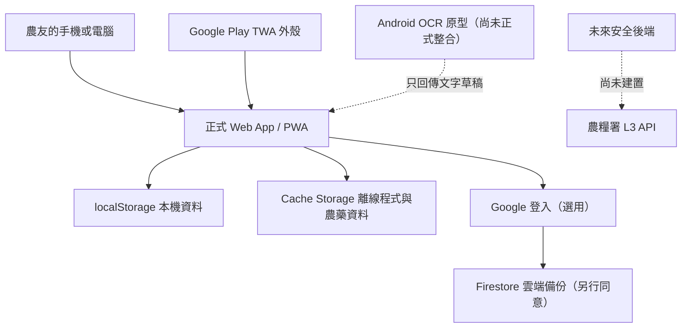
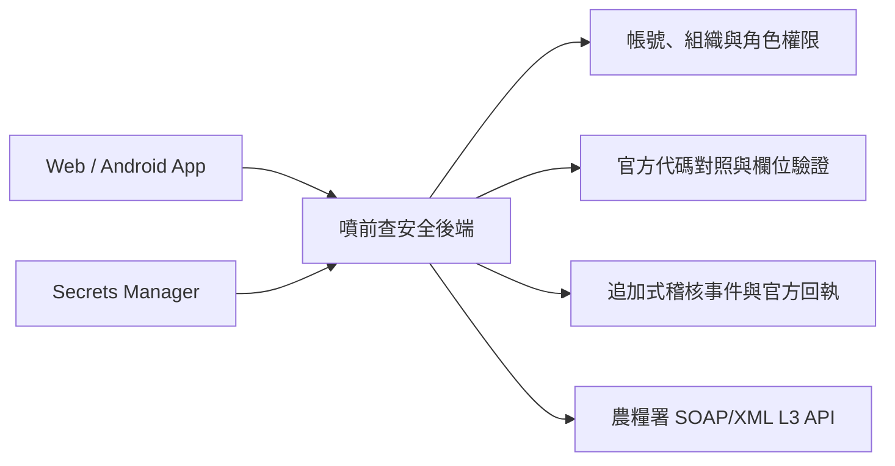

# 噴前查 SearchBefore：從零理解整個 App 的技術教材

更新日期：2026-08-02  
對應版本：Web App `0.3.6.3`  
用途：把本文件連同專案原始碼交給 ChatGPT，請它依照後面的課程順序，從零開始教會專案擁有者理解、修改、測試與維護噴前查。

> 這份文件描述的是目前儲存庫的真實架構，不是理想化的全新系統。教學時必須分清楚「已正式運作」「內部試作」「未來規劃」，不能把尚未完成的 OCR、MRL 或 L3 串接說成已上線。

---

## 0. 給教學者的使用說明

學習者是噴前查的產品擁有者，具有植物醫學與農業領域知識，但不是資深軟體工程師。教學目標不是讓他背術語，而是讓他最後能：

1. 說明每個主要檔案的用途。
2. 看懂資料從農業部開放資料進入 App 的路徑。
3. 安全地修改小功能，不破壞採收期、田區或離線快取。
4. 看懂測試失敗在保護什麼。
5. 分辨前端、Firebase、Android 外殼與未來後端的責任。
6. 知道哪些設定可以公開、哪些絕不能放進 GitHub。
7. 和工程師討論 Firebase、PWA、TWA、OCR、L3 API 與資安設計。

教學時請遵守：

- 一次只教一章，先用白話與農務比喻，再進入程式碼。
- 每個術語第一次出現時，先解釋「它解決什麼問題」。
- 每章先問 2～3 題確認理解，再給一個不會破壞正式資料的小練習。
- 不要直接叫學習者改 `main`，所有練習都在新分支。
- 不要要求學習者把密碼、keystore、Firebase 管理員金鑰或 L3 憑證貼到對話。
- 不確定目前程式時，先閱讀對應檔案，不要依一般框架經驗猜測。
- 農藥、MRL 與安全採收期的業務規則優先於「程式碼寫起來比較方便」。

---

# 第一部分：先建立全貌

## 1. 這個 App 到底是什麼

噴前查是給台灣農友使用的田間工具，核心流程是：

```text
查合法登記藥劑
→ 查看稀釋倍數與安全採收期
→ 計算現場配藥量
→ 留下施藥紀錄
→ 依田區計算最晚可採日
→ 整理其他農務紀錄
→ 匯出與備份
```

目前正式產品的技術本質是：

- 一個以 HTML、CSS、原生 JavaScript 製作的單頁 Web App。
- 不使用 React、Vue、Angular 或大型後端框架。
- 農藥登記資料直接內嵌在 `index.html`，因此首次下載後能離線查詢。
- 預設把農友紀錄存在瀏覽器 `localStorage`。
- Google 登入與 Firestore 雲端備份是選用功能。
- Service Worker 讓網站成為可安裝、可離線使用的 PWA。
- Google Play 版本目前主要是 TWA 外殼：Android App 顯示 `searchbefore.tw` 的網站內容。
- Android OCR 是另外開發的原型模組，尚未正式整合進 Google Play App。
- MRL 對照、資訊服務專員協作與 L3 API 都還沒有公開成正式功能。

## 2. 三層產品架構



白話比喻：

- `index.html` 與各 JavaScript 是農友手上的「工作本體」。
- `localStorage` 是放在這台手機裡的紀錄簿。
- Firestore 是使用者主動開啟後的異地備份櫃。
- Service Worker 是把工具與資料預先放進手機的離線管理員。
- TWA 是讓網站以 Android App 形式開啟的外殼。
- 未來 L3 後端會像受管制的公文交換室；正式憑證不能交給瀏覽器保管。

## 3. 正式、開發中與未來功能

| 類型 | 功能 | 現況 |
|---|---|---|
| 正式 | 作物查藥、藥劑反查、模糊搜尋 | 已公開 |
| 正式 | 配藥換算、常用配方 | 已公開 |
| 正式 | 田區、施藥、採收倒數、五類農務紀錄 | 已公開 |
| 正式 | CSV、Excel、列印/PDF、JSON 備份 | 已公開 |
| 正式 | Google 登入、選用 Firestore 同步 | 已公開，但需使用者另行同意同步 |
| 正式 | PWA 離線使用與網站更新提示 | 已公開 |
| 條件式 | 綠界純自願支持 | 由環境與遠端設定控制，不提供任何功能權益 |
| 暫時隱藏 | 拍照辨識表單建立草稿 | 已改為 Cloud Run／Google Cloud Vision 架構，`formOcr=hidden`；部署、隱私與實機驗收完成後才開放指定測試，結果仍須人工確認 |
| 內部 | 資訊服務專員協作流程 | 純狀態模型與本機假資料介面，不進正式 build |
| 內部 | 特殊作業對應官方項目 | 純狀態模型與本機假資料介面，不進正式 build |
| 後端資料準備 | MRL 對照 | 人工複核中，未接前端 |
| 未來 | L3 API 直接上傳 | 尚未取得規格與測試環境，也尚未建立安全後端 |

---

# 第二部分：先學會看專案

## 4. 儲存庫地圖

### 正式執行檔

| 檔案 | 用途 |
|---|---|
| `index.html` | 主畫面、CSS、內嵌農藥 `DATA`、主要 UI 控制與本機狀態 |
| `safety.js` | 安全採收期、劑型判斷、田區採收狀態；安全核心 |
| `query-aids.js` | 害物從屬提示、種子處理辨識、藥劑本位索引與建議 |
| `crop-forms.js` | 同作物不同收穫型態的分類與消歧 |
| `farm-records.js` | 五類農務紀錄、時間軸、備份格式與整合匯出資料 |
| `export-formats.js` | 不依賴第三方套件產生 XLSX、列印 HTML 與 CRC32 |
| `account.js` | Firebase Google 登入，只負責身分 |
| `cloud-sync.js` | Firestore 雲端同步，只負責資料同步 |
| `service-config.js` | 可公開的 Firebase Web 設定、回饋信箱、功能旗標 |
| `web-support-config.js` | 按需載入的綠界支持連結與遠端開關 |
| `form-ocr.js` | OCR 文字品質與欄位候選解析核心，目前為明確標示的測試功能 |
| `form-ocr-ui.js` | Web 與 Android OCR 訊息橋接及人工確認介面 |
| `sw.js` | Service Worker：離線快取、更新版本與執行期設定載入 |
| `manifest.webmanifest` | PWA 名稱、顏色、啟動方式與圖示 |
| `privacy.html` | 隱私權政策 |
| `delete-account.html` | 帳號與雲端資料刪除說明 |
| `about.html` | App 功能、資料來源與界線介紹 |

### 建置、測試與部署

| 路徑 | 用途 |
|---|---|
| `tests/` | Node.js 自動測試；保護安全規則、資料轉換與發布邊界 |
| `scripts/build-release.mjs` | 壓縮正式 HTML/JS 並只複製白名單檔案到 `dist/` |
| `scripts/check-release.mjs` | 檢查成品清單、私鑰、Source Map、網址、語法與快取檔案 |
| `scripts/bump-version.mjs` | 同步更新 App 與 Service Worker 版本 |
| `scripts/new-branch.mjs` | 從最新 `main` 安全建立工作分支 |
| `firebase.json` | Firestore rules 與 Firebase Hosting 設定；目前正式網站尚非由此 Hosting 提供 |
| `firestore.rules` | Firestore 使用者資料隔離規則 |
| `.well-known/assetlinks.json` | 驗證 Android App 與 `searchbefore.tw` 的關係 |

### 資料與研究

| 路徑 | 用途 |
|---|---|
| `scripts/fetch-pesticide-source.mjs` | 下載農業部農藥許可證與使用範圍 |
| `scripts/build-data.mjs` | 整理成 App 使用的 `DATA` |
| `scripts/compare-data.mjs` | 新舊資料安全差異檢查 |
| `mrl-data/` | MRL、免訂容許量、作物分類、成分對照與人工複核管線 |
| `android-ocr-prototype/` | 裝置端中文 OCR 的 Android Library 與測試 App |
| `tap-workflow.js` | 未發布的專員協作狀態模型 |
| `tap-activity-mapping.js` | 未發布的特殊作業對照模型 |
| `dev/` | 只供本機查看的假資料測試前端 |

## 5. 為什麼採用「原生 JavaScript + 大型 index.html」

優點：

- 部署簡單，GitHub Pages 就能運作。
- 沒有框架 runtime，離線包袱較小。
- 農藥資料與核心畫面可以一次快取。
- Node 測試可以直接載入 UMD 模組。

代價：

- `index.html` 很大，UI、狀態與資料集中在一起，不容易維護。
- 有大量 inline `onclick` 與 `innerHTML`，增加 XSS 與 CSP 改造難度。
- 沒有 TypeScript，資料型別只能靠驗證函式與測試維護。
- 每次資料更新都會改動巨型檔案，Git 差異不易人工閱讀。

教學時要先理解現況，再討論漸進式拆分；不要一開始就把整個 App 重寫成 React，否則會同時冒著資料、安全採收與離線更新回歸風險。

---

# 第三部分：瀏覽器裡的程式怎麼啟動

## 6. 載入順序

`index.html` 依序載入：

```text
service-config.js
account.js
cloud-sync.js
safety.js
farm-records.js
crop-forms.js
query-aids.js
form-ocr.js
form-ocr-ui.js
export-formats.js
最後才是 index.html 的主要 inline 程式
```

這個順序有意義：主要程式使用 `PQC_SAFETY`、`PQC_FARM` 等全域 API，所以對應模組要先存在。

多數核心模組使用 UMD 風格：

```javascript
// 瀏覽器中掛到 window，例如 window.PQC_SAFETY
// Node 測試中則使用 module.exports
```

因此同一份規則既能給瀏覽器用，也能由 Node.js 單元測試直接載入。

## 7. 畫面架構

底部有六個主要頁面：

| 畫面 ID | 顯示名稱 | 核心用途 |
|---|---|---|
| `scr-search` | 查詢 | 作物找藥、藥劑反查、查看登記資訊 |
| `scr-calc` | 計算 | 依桶水量、倍數、桶數或面積估算用量 |
| `scr-recipes` | 配方 | 保存常用查詢與配藥資料 |
| `scr-harvest` | 倒數 | 依田區彙整施藥紀錄與最晚可採日 |
| `scr-records` | 紀錄 | 田區管理、其他農務、歷史及匯出 |
| `scr-profile` | 個人 | 顯示偏好、登入、同步、備份、回饋與支持 |

`go(name, button)` 負責切換畫面。這是單頁應用：頁面沒有真的重新載入，只是切換各 `<section>` 的顯示狀態。

## 8. 全域狀態與重新渲染

App 沒有 Redux 或 Vue reactive state，而是：

1. 從 `localStorage` 讀成 JavaScript 陣列／物件。
2. 使用者操作後修改陣列。
3. 呼叫 `store.set(key, value)` 保存。
4. 再呼叫對應 `render...()` 重畫畫面。

主要狀態包括：

```text
records       施藥紀錄
fieldPlots    田區／種植批次
farmRecords   其他農務紀錄
recipes       常用配方
recentCrops   最近查詢作物
activePlotId  預設田區
displayPrefs  字體、深色、高對比偏好
```

`store` 是本機儲存的單一入口。`cloud-sync.js` 透過 `beforeStore()` 與 `afterStore()` 攔截特定集合，補上同步時間並排程同步。

---

# 第四部分：農藥資料與查詢

## 9. `DATA` 的資料模型

目前農藥資料內嵌在 `index.html`：

```javascript
DATA[作物名][防治對象] = [
  {
    name: "普通名稱／有效成分名稱",
    form: "劑型代碼",
    content: "含量原文",
    dilution: "稀釋倍數原文",
    phi: 7,
    dose: "每公頃用量原文",
    times: "施用次數原文",
    moa: "IRAC／FRAC／HRAC 代碼",
    note: "官方備註",
    bl: ["商品名一", "商品名二"]
  }
]
```

目前 `DATA_VERSION 2026-07-21` 的實際資料規模為 287 種作物、2,852 組作物×防治對象、17,333 筆登記用法；每次重抓資料後數字可能改變。

重要語意：

- `phi: null` 代表未提供、未訂或不適用，不能解讀成 0 天。
- `phi: 0` 才是真正的 0 天。
- `dilution`、`dose`、`times`、`note` 保留官方原文，不能隨意轉成看似精確的數字。
- `bl` 是相同成分與用法下聚合的商品名。

## 10. 作物找藥

基本資料路徑：

```text
輸入作物
→ 模糊搜尋與俗名對照
→ 選定官方作物名稱
→ 列出該作物的防治對象
→ 列出該「作物 × 防治對象」的登記藥劑
```

安全紅線：目前 `PQC_SAFETY.directCropLevels()` 刻意只允許作物本身的直接登記，不自動把上層作物群組展開成合法結論。原因是群組適用範圍仍需逐項校驗。

## 11. 藥劑反查

`query-aids.js` 的 `buildAgentIndex(DATA)` 第一次使用時建立索引：

- 普通名稱指向所有實際登記作物與防治對象。
- 商品名也可以當搜尋入口。
- 同一商品名若對應多個普通名稱，必須列出全部候選，不擅自選一個。
- 索引保存對原始 `DATA` 物件的參照，不複製另一套採收期資料，避免兩份資料不一致。

## 12. 模糊搜尋與俗名

App 同時使用：

- 字串正規化。
- 作物俗名對照，例如地瓜→甘藷、芭樂→番石榴。
- 部分拼寫或命中分數排序。
- 找不到時顯示建議，但不自動把近似名稱當成同一作物。

「建議候選」和「正式選定」必須分開。胡麻事件證明：名稱看似接近，仍可能在法規資料中是不同項目。

## 13. 害物從屬與作物型態

`query-aids.js` 可提示強證據的上位／下位害物關係，但只做提示，不能擴大登記。

`crop-forms.js` 處理同一作物可能有果實、葉、種子、根等不同收穫型態的情況。使用者選定型態後，UI 可以分開顯示適用與不適用的候選；它的目的也是避免「名稱相同就全部混在一起」。

---

# 第五部分：安全採收與配藥核心

## 14. 安全採收期不是只讀 `phi`

`safety.js` 的 `effectivePhi(row)` 會比較：

```text
結構化 phi 欄位
與
官方備註中可辨認的採收期天數
```

最後取較保守、較長的值。因為部分官方資料在備註中另訂設施栽培或特殊條件的更長天數。

不能在 UI 直接使用 `row.phi`，所有安全採收期顯示與紀錄建立都應經過 `PQC_SAFETY.effectivePhi()`。

## 15. 可採日期算法

`safeHarvestDate(date, phi)` 採保守算法：

```text
施藥當日不算第一天
從隔日起算 phi 天
可採日 = 施藥日期 + phi + 1 日
```

教學時要用具體日期練習，並說明這是本專案的保守規則，實際仍以產品標示與主管機關公告為準。

## 16. 同田區多次施藥

`aggregateHarvest(records)` 會按 `plotId` 分組：

- 每筆實際施藥都納入。
- 已知採收期的紀錄取最晚可採日。
- 任一筆採收期未知，整個田區都不能顯示確定可採日。
- `track`、提醒偏好等 UI 選項不能排除安全計算。

這是「一筆不確定，不可用其他已知紀錄把它蓋掉」的安全原則。

## 17. 採收紀錄的連動

`harvestStatus(records, plotId, harvestDate)` 回傳：

| 狀態 | 意義 |
|---|---|
| `none` | 該田區沒有可連動的施藥紀錄，不代表已證明可以採收 |
| `unknown` | 至少一筆採收期缺少，無法判定 |
| `waiting` | 還沒到最晚可採日 |
| `safe` | 依目前 App 紀錄已到日期 |
| `invalid` | 日期格式不正確 |

即使是 `waiting` 或 `unknown`，App 仍允許農民保存「已實際發生」的採收事實，但會先警告並保存當時判定快照。紀錄事實與安全建議不能混為一談。

## 18. 配藥換算

配藥畫面有兩類概念：

- 依「水量 ÷ 稀釋倍數」算每桶藥量。
- 若官方有每公頃用藥量，可依田區面積估算整區水量、桶數與藥量。

必須保留的安全規則：

- 粉劑只顯示重量，不換算成瓶蓋、湯匙等不可靠容器。
- 液劑才可在合適情況顯示 mL 容量。
- 沒有每公頃用量時，不假造面積估算。
- 計算結果是現場輔助，仍需核對產品標示、機具、車速、噴頭與作物密度。

---

# 第六部分：田區、紀錄與匯出

## 19. 田區與種植批次

`fieldPlots` 中的每筆資料代表一個作物批次，而不只是永久地號。概念上至少包含：

```javascript
{
  id,
  crop,
  plantingDate,
  variety,
  tag,
  updatedAt
}
```

同一塊地不同季、不同作物或不同棚可以建立不同批次。`plotId` 是施藥與農務紀錄串在一起的主鍵。

## 20. 施藥紀錄

`records` 的典型欄位：

```javascript
{
  id,
  plotId,
  crop,
  pest,
  agent,
  form,
  dilution,
  phi,
  moa,
  date,
  updatedAt
}
```

實際欄位以程式為準。安全相關欄位應由查詢結果帶入，不讓使用者用自由文字偽造某藥已登記。

## 21. 五類其他農務紀錄

`farm-records.js` 定義：

1. `cultivation`：栽培作業。
2. `fertilizer`：施肥。
3. `harvest`：採收。
4. `postharvest`：採後處理。
5. `materialPurchase`：資材購入。

`createRecord(input)` 負責必填欄位、日期與數值驗證。`summary(record)` 只負責產生可讀摘要。不同類型的詳細資料放在 `details` 中。

## 22. 時間軸與完整作業鏈

`PQC_FARM.buildTimeline()` 把施藥與其他農務紀錄按日期合併。`recordCoverage()` 計算各類筆數，用來顯示作業鏈概況。

目前輸出是農友自主整理格式，不是官方 TAP 匯入規格；直到農糧署提供 API 規格前，不能把「欄位排列相近」說成「可以直接上傳」。

## 23. 匯出格式

- CSV：適合跨系統、純文字與人工檢視。
- XLSX：`export-formats.js` 自行組裝 Open XML ZIP，不依賴大型試算表套件。
- 列印/PDF：產生已跳脫內容的表格 HTML，交給瀏覽器列印或另存 PDF。
- JSON 完整備份：保存 App 可再次讀入的結構化資料。

CSV 要處理逗號、雙引號、換行與試算表公式注入；HTML／XML 要做對應跳脫。不同輸出格式的 escape 函式不可混用。

## 24. 備份匯入的目前風險

`readBackup()` 目前只驗證外層格式與陣列，尚未逐筆限制 ID、欄位長度與允許字元。部分 ID 又會被拼進 inline `onclick`，因此惡意備份可能造成儲存型程式碼注入。

未來正確方向：

1. 對每一種資料建立完整 schema。
2. 限制檔案大小、筆數、字串長度、日期、數值與 ID 格式。
3. 匯入後重新產生安全 ID 或嚴格驗證 ID。
4. 移除資料驅動的 inline `onclick`，改用 DOM API 與 `addEventListener()`。
5. 加入惡意備份回歸測試。

---

# 第七部分：Google 登入與雲端同步

## 25. 為什麼登入與同步刻意分成兩個檔案

`account.js` 只回答「現在是誰」；`cloud-sync.js` 才回答「要不要把哪些資料上傳」。這能維持一條重要隱私界線：

```text
使用 Google 登入 ≠ 同意上傳田間資料
```

使用者登入後還必須另按「開啟 Google 雲端備份」並確認資料範圍。

## 26. Firebase Web 設定是不是秘密

`service-config.js` 中的 `apiKey`、`authDomain`、`projectId` 與 `appId` 會被瀏覽器下載。Firebase Web API key 是專案識別資料，不是管理員私鑰。

真正安全邊界是：

- Firebase Authentication。
- Firestore Security Rules。
- Authorized domains。
- Google Cloud API key 的 API 與網站來源限制。
- App Check、用量與預算告警。

絕不能公開的東西包括：Service Account JSON、Private Key、Admin SDK 憑證、keystore 密碼、L3 憑證、付款密鑰。

## 27. Google 登入流程

`account.js`：

1. 讀取公開 Firebase 設定。
2. 從 Google CDN 動態載入 Firebase Auth 12.15.0。
3. 建立 Google Provider。
4. 使用 popup 登入並採 `browserLocalPersistence`。
5. 透過 `onAuthStateChanged` 更新介面並通知同步層。

本機 `file://` 預覽刻意不執行 Google 授權，避免授權網域錯誤。

## 28. Firestore 資料路徑與規則

資料路徑：

```text
users/{uid}/records/{docId}
users/{uid}/fieldPlots/{docId}
users/{uid}/farmRecords/{docId}
```

`firestore.rules` 要求：

- 必須已登入。
- `request.auth.uid` 必須等於路徑中的 `userId`。
- collection 只能是上述三種。
- 其他所有文件預設拒絕。

儲存庫有規則不代表正式後台已部署。上線檢查必須用兩個測試帳號證明 A 不能讀寫 B。

## 29. local-first 同步算法

同步設計不是「雲端資料取代本機」，而是本機優先合併：

1. 每次 `store.set()` 更新同步集合時補上嚴格遞增的 `updatedAt`。
2. 刪除時建立 `_deleted:true` 的 tombstone，防止另一台裝置讓資料復活。
3. `mergeCollection(local, remote)` 以 `updatedAt` 選較新版本。
4. 時間相同時，刪除優先。
5. 完全相同時採 remote，避免每次都把整批資料重傳。
6. 首次全量讀取；之後只讀取上次成功同步時間之後的變動。
7. 整輪成功後才更新 `syncLastAt`，中途失敗不會漏資料。

帳號保護：裝置曾同步 A 帳號後改登入 B，不會直接把 A 的本機紀錄上傳給 B；必須由使用者明確選擇接管。

已知限制：tombstone 保存 180 天，超過 180 天未連線的舊裝置理論上可能把舊資料帶回；未來需要更完整的同步世代或裝置失效設計。

---

# 第八部分：PWA、離線與更新

## 30. PWA 的三個要件

1. HTTPS 網站。
2. `manifest.webmanifest`。
3. Service Worker。

manifest 設定 `display: standalone`、portrait、啟動路徑、主題顏色及多尺寸圖示，讓網站可被加到主畫面並像 App 開啟。

## 31. Service Worker 做什麼

`sw.js` 有三類策略：

- 導覽：快取優先，背景取得新首頁。
- 一般同網域檔案與 Google Fonts：cache-first。
- `service-config.js`、`web-support-config.js`：network-first，離線才讀快取，讓登入／付款開關可以較快更新。

安裝新版時不立即 `skipWaiting`，而是讓使用者按「立即更新」，避免操作到一半被重新載入。

## 32. 為什麼換版要同步改 `CACHE_VERSION`

如果改了 `index.html` 卻沒有改 Service Worker 的快取版本：

- 開發者電腦可能看到新程式。
- 農友手機仍持續使用舊快取。
- 系統不一定報錯。

因此使用：

```bash
npm run release:bump -- 0.3.6.4 功能代號
```

腳本會同步修改 App 版本、Service Worker 版本與測試釘住值。

---

# 第九部分：Android、TWA 與 OCR

## 33. PWA、TWA、APK、AAB 的差異

- PWA：可安裝的網站。
- TWA：Android 原生外殼，以全螢幕方式顯示已驗證的網站。
- APK：可直接安裝的 Android 套件。
- AAB：提交 Google Play，由 Google 產生各裝置 APK 的發布格式。

正式套件名稱是 `tw.searchbefore.app`，不可任意更改。Digital Asset Links 透過 `.well-known/assetlinks.json` 證明 App 與網域屬於同一方；`.nojekyll` 用來確保 GitHub Pages 不忽略 `.well-known`。

一般網站功能或農藥資料更新不需重新提交 AAB，因為 TWA 會載入最新網站。只有 App 圖示、名稱、target SDK、TWA 原生設定、原生 OCR 或 Play Billing 等原生變動才需新 AAB。

## 34. OCR 原型的技術路徑

Android Library `ocr-feature`：

```text
ML Kit 文件掃描器
→ 裁切文件
→ OcrQualityEstimator 檢查解析度／清晰度／反光
→ ML Kit 繁體中文文字辨識
→ 只回傳文字區塊、位置與品質
```

Web 端：

```text
form-ocr-ui.js 發出帶 requestId 的掃描請求
→ Android ScanActivity 執行
→ 經已驗證的 TWA postMessage channel 回傳 JSON
→ form-ocr.js 建立欄位候選
→ 使用者逐欄核對
→ 只帶入原表單，不自動保存、不自動上傳
```

安全規則：

- 不把照片、Base64、檔案路徑或 URI 傳給網頁。
- 來源只允許 `https://searchbefore.tw` 與正式 Android origin。
- 驗證訊息類型、協定版本、大小與 `requestId`。
- 藥劑內容必須唯一對回正式登記資料。
- 低品質或不明欄位要求重拍／人工確認。
- `formOcr` 目前為 `development`，只可顯示為「測試中・開發中」，不得宣稱已完成自動登打。

目前缺口：正式 TWA Android 原始碼尚未留存，只有已編譯套件與 OCR Prototype；要正式整合，需重新取得或建立正式 Android 工程並使用原簽章流程發布。

---

# 第十部分：MRL 與產銷履歷研發

## 35. 農藥登記、MRL 與安全採收期是三件事

- 農藥登記：某藥能否依標示用於某作物與防治對象。
- 安全採收期：施藥後至少隔多久採收。
- MRL：特定有效成分在特定農產品的殘留容許量。

即使依登記與採收期施用，也不能保證實際檢驗一定通過；MRL 也不能反過來證明某藥有登記可以使用。

## 36. MRL 對照管線

```text
App 農藥普通名稱
→ 官方許可證
→ 一種或多種英文有效成分
→ MRL／免訂清單
→ 特定作物、官方分類或通用列
→ 人工複核
→ 可追溯的後端白名單
```

目前 `mrl-data/` 已有下載、快照、雜湊、混合劑拆解、名稱對照、作物分類候選與人工複核工具，但尚未接前端。

任何一層不明時只能顯示「無法確認」，不能由「查無」直接推論「不得檢出」或「安全」。95 筆候選已建立人工複核紀錄，但只有完成全部條件的少數資料可進後端白名單，而且目前仍未啟用。

## 37. 資訊服務專員協作模型

內部模型的目標不是取代登打員，而是：

```text
農民留下現場事實
→ 噴前查整理未確認草稿
→ 資訊服務專員檢核、退回或補漏
→ 專員依現行官方流程登打
```

`tap-workflow.js` 使用事件與狀態保留版本變化。目前只允許沒有串接、人工聲明待處理與人工聲明未查證等中性狀態；在取得真正官方回執前禁止出現 `accepted` 或「已上傳成功」。

## 38. 未來 L3 架構

L3 API 不能由 GitHub Pages 或 APK 直接呼叫：



後端要負責：

- L3 憑證與固定 IP。
- Firebase UID 與 L3 組織綁定。
- 農民、專員、組織管理員與維運人員的權限矩陣。
- 官方代碼下載與版本。
- 建立、修改、刪除、產季結束的再次確認。
- 冪等、重試、錯誤狀態與官方回執。
- 不可由客戶端竄改的稽核紀錄。
- 隱私、保留、刪除、備援與資安事件處理。

正式規格與測試環境要等農糧署核准後取得；在此之前不自創正式代碼、不模擬官方成功。

---

# 第十一部分：資安與隱私

## 39. 現有信任邊界

| 邊界 | 可以信任到什麼程度 |
|---|---|
| 使用者輸入 | 一律不可信，顯示前要依 HTML／attribute／JS／CSV 情境正確編碼 |
| JSON 備份 | 一律不可信，即使副檔名正確也可能被修改 |
| localStorage | 可保存一般本機狀態，但不是安全祕密儲存區 |
| Firebase Web config | 公開識別設定，不是管理員秘密 |
| Firebase 登入 token | 由 SDK 管理；後端／rules 仍需驗證使用者與權限 |
| Firestore 規則 | 是正式資料邊界，但必須確認後台已部署並測試 |
| Android APK | 使用者可反編譯，不能保存真正秘密 |
| L3／付款伺服器憑證 | 只能放在受控後端秘密管理服務 |

## 40. 目前優先資安工作

1. 修正惡意備份匯入的儲存型程式碼注入路徑。
2. 確認 Firestore 正式 rules、App Check、Authorized domains、API key 限制與預算告警。
3. 建立可驗證身分的帳號／雲端資料刪除流程。
4. 在正式 Hosting 增加 CSP、HSTS、nosniff、frame 防護與權限標頭。
5. 逐步移除 inline event handler 與資料驅動 `innerHTML`。
6. 為共用裝置提供清除本機資料與登出提醒。
7. L3 前先完成後端威脅模型。

詳細證據與分級見 `docs/APP資安與隱私審視-2026-08-02.md`。

## 41. 隱私設計原則

- 預設本機，不強迫登入。
- 登入與同步分開同意。
- 清楚列出會同步與不會同步的資料。
- OCR 原圖不離開裝置，文字也只建立未確認草稿。
- 不把農務資料用於廣告或不相干分析。
- 刪除承諾必須和真正可執行的後台流程一致。
- 未來多人協作前需加入農民的明示分享同意與撤銷權。

---

# 第十二部分：測試、版本、建置與 GitHub

## 42. 測試不是只有「程式會不會當掉」

`tests/run-all.js` 會執行多組測試，包括：

- 安全採收期與多次施藥。
- 粉劑／液劑換算界線。
- 作物型態、害物從屬與藥劑反查。
- 田間紀錄、匯出與備份。
- Google 登入與雲端同步。
- 付款環境隔離。
- OCR 訊息來源、品質與不傳照片。
- MRL 後端閘門。
- 內部開發模組不得進正式 build。
- HTML JavaScript 語法、Service Worker 與 assetlinks。

執行：

```bash
npm test
```

完整發布檢查：

```bash
npm run release:check
```

它會做：測試 → 壓縮建置 → 檢查 `dist/` 白名單、語法、私鑰、Source Map、正式網址與 Service Worker 快取完整性。

## 43. Git 工作方式

```text
main = 正式網站
工作分支 = 本次改動
Pull Request = 檢查與討論入口
Squash and merge = 將整個 PR 合成 main 上的一筆 commit
```

標準流程：

```bash
git status
npm run branch -- fix/簡短名稱
# 修改
npm test
git add 指定檔案
git commit -m "清楚說明"
git push
# 建立 PR，確認後 squash merge
```

不要在已被 squash 合併的舊分支繼續追加，否則會產生孤兒 commit 或重複衝突。

## 44. 目前兩種部署現況

目前正式網址：

```text
Cloudflare → GitHub Pages main 根目錄 → searchbefore.tw
```

儲存庫也準備了：

```text
source → npm run build → dist 白名單 → Firebase Hosting
```

但 Firebase Hosting 尚未接管正式網域。這代表：

- `firebase.json` 裡的安全標頭目前不會自動出現在正式網站。
- GitHub Pages 直接發布 `main` 根目錄，公開 repo 中的非秘密檔案可能被直接下載。
- 切換 Hosting 前要先用 preview／Firebase 預設網域測試 OAuth、PWA、Service Worker、assetlinks 與自訂網域。

## 45. Android 發布另外一套版本

Web 的 `APP_VERSION`、Service Worker `CACHE_VERSION` 與 Google Play 的 `versionCode` 是三個不同概念：

- `APP_VERSION`：給使用者與程式辨識網頁版本。
- `CACHE_VERSION`：決定 Service Worker 是否建立新快取。
- Android `versionCode`：Play Console 用的單調遞增整數，用過不能重複。

網站改資料通常不用重產 AAB；原生功能與 Play 要求變更才需要。

---

# 第十三部分：建議學習課程

## 46. 十二階段學習路徑

### 第 1 課：網路與網站最基礎

學習：瀏覽器、網址、DNS、HTTPS、HTTP request/response、HTML/CSS/JavaScript。  
練習：用開發者工具找到 `index.html`、一個 CSS 規則與一個按鈕事件。  
過關標準：能白話說出 HTML、CSS、JavaScript 各負責什麼。

### 第 2 課：JavaScript 必要語法

學習：變數、陣列、物件、函式、條件、迴圈、map/filter、事件、async/await、try/catch。  
練習：對三筆假用藥資料做篩選與排序。  
過關標準：能看懂 `records.filter(...).map(...)`。

### 第 3 課：DOM 與單頁介面

學習：元素、ID、class、事件、`textContent`、`innerHTML`、畫面切換與重新渲染。  
練習：在獨立測試頁新增一張不使用 `innerHTML` 的安全卡片。  
過關標準：知道使用者文字為什麼優先用 `textContent`。

### 第 4 課：噴前查的資料模型

學習：`DATA`、`records`、`fieldPlots`、`farmRecords`、`recipes`。  
練習：手動追一筆「作物→害物→藥劑→紀錄→可採日」。  
過關標準：能指出每一階段資料放在哪裡。

### 第 5 課：業務安全規則

學習：`effectivePhi`、日期算法、同田區彙整、未知值、直接登記、模糊名稱界線。  
練習：用紙筆算三次施藥的最晚可採日，再和測試比較。  
過關標準：能解釋為何一筆未知就不能顯示可採。

### 第 6 課：本機儲存與備份

學習：JSON、localStorage、schema、migration、匯出與不可信匯入。  
練習：檢視一份自己產生的測試備份，不使用真實農友資料。  
過關標準：知道 JSON 檔不代表安全，仍需逐欄驗證。

### 第 7 課：Google 登入與 Firebase

學習：Authentication、UID、Firestore collection/document、Security Rules、公開 config 與秘密。  
練習：畫出 A、B 兩個帳號應能／不能讀取的路徑。  
過關標準：能說明為何 Firebase apiKey 可公開但 Admin key 不可公開。

### 第 8 課：同步與離線

學習：local-first、衝突、updatedAt、tombstone、增量同步、PWA、Cache Storage、Service Worker lifecycle。  
練習：模擬兩台裝置同時修改與刪除一筆資料。  
過關標準：能說明為何刪除也要同步成一筆資料。

### 第 9 課：測試與除錯

學習：assert、unit test、integration boundary、回歸測試、開發者工具 Console/Network/Application。  
練習：先新增一個失敗測試，再做最小修正讓它通過。  
過關標準：知道測試失敗時先讀錯誤，不直接刪測試。

### 第 10 課：Git、PR 與發布

學習：commit、branch、remote、PR、squash、merge、build、deploy、cache version。  
練習：在練習分支只改一行說明文字，跑測試並查看 diff。  
過關標準：能完整描述從改檔到農友看到更新的路徑。

### 第 11 課：Android、TWA 與 OCR

學習：PWA/TWA/APK/AAB、package name、keystore、assetlinks、Activity、ML Kit、postMessage。  
練習：畫出 OCR 照片、文字草稿與正式紀錄各自停留的位置。  
過關標準：能說明為何 OCR 結果不能自動建立正式紀錄。

### 第 12 課：後端、資安與 L3

學習：API、SOAP/XML、server、fixed IP、secret manager、RBAC、audit log、idempotency、backup、incident response。  
練習：設計一筆 L3 紀錄從草稿到官方回執的狀態圖。  
過關標準：能說明為何 L3 憑證不能放在目前的靜態網站。

---

# 第十四部分：可直接交給 ChatGPT 的提示詞

## 47. 主提示詞

把本文件與專案檔案提供給 ChatGPT 後，可貼上：

```text
你是我的一對一軟體技術老師。我是「噴前查 SearchBefore」的產品擁有者，熟悉植物醫學與農業流程，但軟體開發是初學者。

請完整閱讀我提供的《噴前查 SearchBefore：從零理解整個 App 的技術教材》與實際專案檔案。教材若與程式碼衝突，以目前程式碼為準，但請指出差異，不要默默改寫事實。

請依教材第 46 節的十二階段順序教我，一次只進行一課。每課固定使用以下格式：
1. 這一課要解決什麼問題。
2. 用白話與農務流程比喻。
3. 對照噴前查的真實檔案與函式。
4. 只展示足夠理解的短程式片段。
5. 說明常見錯誤與本專案的安全紅線。
6. 問我 3 題理解檢查。
7. 給我一個不碰真實資料、不直接修改 main 的小練習。
8. 等我回答後再批改，確認我理解才進下一課。

教學規則：
- 第一次出現的技術名詞必須先解釋用途。
- 不假設 OCR、MRL、資訊服務專員協作或 L3 API 已正式啟用。
- 不要把農藥登記、MRL、安全採收期混為一談。
- 不可教我用作物群組或近似名稱自行推論合法性。
- 不可要求我貼出密碼、私鑰、keystore、管理員憑證或 L3 憑證。
- 所有修改先建立分支、先寫或更新測試、最後才考慮 PR。
- 若你無法從檔案確認，請直接說「需要確認」，不要猜。

現在先做第 1 課。開始前，先用 10 句以內說明整套課程最後會讓我具備哪些能力。
```

## 48. 每次回來繼續學習時

```text
請先用 5 題小測驗確認我是否還記得上一課；依我的回答補強缺口，再繼續下一課。不要一次講兩課。
```

## 49. 要 ChatGPT 帶你看某個 Bug 時

```text
請先不要修改。依照「使用者操作 → 畫面事件 → 狀態變化 → store.set → localStorage／Firestore → render」的順序，帶我追蹤這個問題。每一步告訴我應查看哪個檔案、函式與開發者工具頁籤。確認原因後，再提出最小修正與需要新增的測試。
```

## 50. 要 ChatGPT 教你做新功能時

```text
先判斷這個功能屬於正式前端、隱藏測試、純內部模組、Firebase，還是未來後端。請列出資料模型、信任邊界、失敗狀態、隱私影響、測試與發布流程。沒有完成規格或安全條件時，不要直接做出正式入口。
```

---

# 第十五部分：必須熟記的地雷

## 51. 十五條不可忘記的規則

1. `main` 是正式網站，不直接修改。
2. 每個工作分支都從最新 `main` 建立。
3. 改 `index.html` 或正式資料後要用換版腳本同步更新快取版本。
4. 合併前至少執行 `npm test`；發布前執行 `npm run release:check`。
5. 安全採收期一律經 `effectivePhi()`。
6. 同田區所有施藥紀錄都納入，任一筆未知就不得顯示確定可採。
7. `null` 採收期不等於 0 天。
8. 粉劑不能換算瓶蓋或湯匙。
9. 不從作物群組、近似名稱或查無資料推論合法或違規。
10. MRL、登記與安全採收期是三套不同判斷。
11. 登入不等於同意同步。
12. 前端、APK 與公開 GitHub 不保存伺服器秘密。
13. 未完成的功能預設隱藏；測試入口必須明寫「開發中」。
14. 沒有官方 API 回執前，不顯示已送出、已受理或已核准。
15. 使用者輸入、備份檔、OCR 文字與雲端資料在進入畫面前都要視為不可信。

---

# 第十六部分：術語小字典

| 術語 | 白話解釋 |
|---|---|
| API | 兩套程式依規格交換資料的入口 |
| Authentication | 確認使用者是誰 |
| Authorization | 確認這個人能做什麼 |
| Firebase Auth | Google 提供的登入身分服務 |
| Firestore | 以 collection/document 儲存資料的雲端資料庫 |
| Security Rules | Firestore 在伺服器端判斷可否讀寫的規則 |
| UID | Firebase 給每位登入使用者的唯一代碼 |
| localStorage | 瀏覽器本機的小型永久鍵值儲存 |
| Cache Storage | Service Worker 使用的離線檔案快取 |
| PWA | 可以安裝、離線運作的網站 |
| Service Worker | 在網頁外管理快取與網路請求的背景程式 |
| TWA | 由 Android 外殼全螢幕顯示經驗證網站 |
| APK / AAB | Android 安裝檔／Play 發布包 |
| keystore | Android App 簽章身分，遺失會影響更新 |
| Digital Asset Links | 驗證 Android App 與網站關係的機制 |
| OCR | 從影像辨認文字 |
| schema | 一筆資料允許有哪些欄位、型別與限制 |
| migration | 把舊版資料轉成新版格式 |
| tombstone | 用「已刪除標記」把刪除同步到其他裝置 |
| idempotency | 同一請求重送不會建立重複結果 |
| CSP | 限制網頁可執行哪些程式來源的瀏覽器政策 |
| XSS | 不可信內容被瀏覽器當成程式執行 |
| secret | 能代表系統權限、不可交給公開前端的憑證 |
| audit log | 記錄誰在何時對哪筆資料做了什麼 |
| SOAP / XML | L3 已知使用的 Web Service 協定與資料格式 |
| MRL | 農產品中農藥殘留容許量標準 |
| PHI | 本專案語境中的安全採收期間／天數 |
| IRAC/FRAC/HRAC | 殺蟲劑／殺菌劑／除草劑的作用機制分類 |

---

# 第十七部分：讀完後應能回答的問題

1. 為什麼噴前查沒網路仍能查藥？
2. 為什麼登入 Google 後資料不會立刻上傳？
3. `localStorage`、Cache Storage、Firestore 分別存什麼？
4. 為什麼一筆採收期缺漏會讓整個田區無法判定可採？
5. 為什麼不能只讀原始 `phi`？
6. 為什麼 DATA 的 `null` 不能改成 0？
7. 為什麼作物群組不能直接拿來擴大合法用藥？
8. 為什麼 MRL 不等於農藥登記？
9. 為什麼 Firebase Web API key 可以公開，Service Account 不行？
10. Firestore rules 檔存在，為什麼仍要到後台測試？
11. 為什麼刪除資料要保留 tombstone？
12. 為什麼改網頁後有時農友仍看到舊版本？
13. 哪些變更不需要重傳 AAB？
14. OCR 為什麼只建立草稿？
15. L3 憑證為什麼必須放在後端？
16. `npm test` 和 `npm run release:check` 有何不同？
17. 為什麼已被 squash merge 的分支不應繼續開發？
18. 惡意 JSON 備份可能怎麼傷害 localStorage 資料？
19. 哪些未完成模組被刻意排除在正式 build 之外？
20. 一個新功能需要通過哪些產品、安全、測試與發布判斷才能公開？

如果學習者能以自己的話完整回答以上問題，並能在測試分支完成一個小型修改、加入測試、通過 release check、看懂 diff，就已具備維護目前噴前查前端的基礎能力。要開發正式多人協作或 L3，還需進一步學習後端、資料庫設計、雲端部署、監控與資安營運。

---

## 延伸閱讀順序

1. `README.md`
2. `docs/交接-給下一位開發者.md`
3. `docs/資料與版本更新流程.md`
4. `docs/APP資安與隱私審視-2026-08-02.md`
5. `docs/帳號與付款設定.md`
6. `docs/Android OCR正式整合.md`
7. `docs/MRL對照實施手冊.md`
8. `mrl-data/資料夾索引.md`
9. `docs/產銷履歷串接-路線圖.md`
10. `docs/L3介接申請與上線流程備忘.md`

這份教材是導覽與學習地圖；實際修改前仍應閱讀對應原始檔與專門文件。
